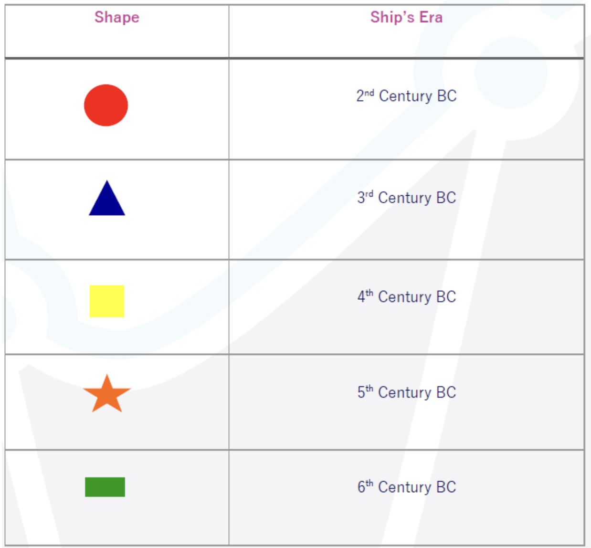

YOLOv4 Shape Classifier (You Only Look Once) 
==================

In this project, we have used YOLO (You Only Look Once) deep learning framework to classify different images and tag them as a triangle, square , circle , rectangle or a star.

We used a pre-trained YOLOv4 model after fine tuning on our custom dataset it to make predictions on a single image or a video.

We used the opencv_dnn module to be able to import our saved weights into OpenCV.
 
## Output:
We used opencv library to visualize the output of the model,the model returns class of the shape, confidence of the prediction (percentage) and the bounding box of the shape.
 

## How to run this project:
- First, you need to download the weights file from google drive :[Weights file link](https://drive.google.com/drive/folders/1I_WlLuXCIbyRgo_OZTUBEA1m01-7A5xI?usp=sharing)
- Second step is to load pre-trained model weights and config file.
- Then you can choose to classify an image or a video and choosing the path of the image or the video

## References:
>[YOLO: Real-Time Object Detection](https://github.com/AlexeyAB/darknet)
